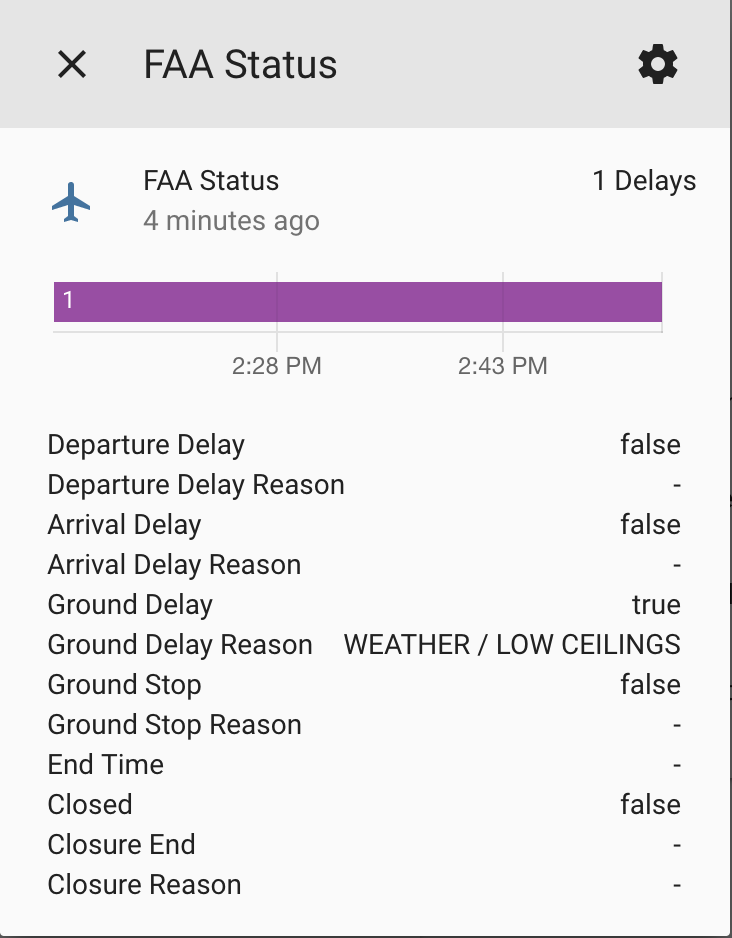

# custom_component to get info from FAA Airspace API
[](https://github.com/custom-components/hacs)

A platform which allows you to get information from the FAA National Airspace System API.


To get started put all the files from `/custom_components/faastatus/` here:
`<config directory>/custom_components/faastatus/`

**Example configuration.yaml:**

```yaml
sensor:
  platform: faastatus
  id: ATL
```

**Configuration variables:**

key | description
:--- | :---
**platform (Required)** | The platform name.
**ID (Required)** | Three letter IATA identifier for airport you want to monitor. See below for information on supported airports.

**Supported airports:**

The FAA officially supports the airports below. However, most airports in the United States will return data. The component will check to see if the airport returns any data and if it does, it will setup a sensor with a warning if it is not in the supported list. This should not cause any problems, but this is not officially supported per the API.

BOS, LGA, TEB, EWR, JFK, PHL, PIT, IAD, BWI, DCA, RDU, CLT, ATL, MCO, TPA, MCO, FLL, MIA, DTW, CLE, MDW, ORD, IND, CVG, BNA, MEM, STL, MCI, MSP, DFW, IAH, DEN, SLC, PHX, LAS, SAN, LAX, SJC, SFO, PDX, SEA

## Sample overview



## Attributes

The sensor displays total number of delays at the indicated airport, and then displays the delay types (arrival, departure, ground delay, ground stop, closure) in attributes.
